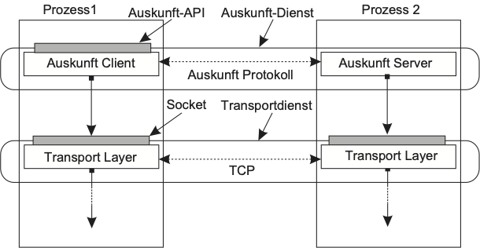

# **Labor 1** - Mehrschicht Architekturen mit Sockets

Im ersten Labor konstruieren wir ein einfaches Client-Server System mit
low-level **Sockets** und lernen dabei eine Menge über die Sprache **Python**
und den Umgang mit Python-basierten Software Systemen. Die Ziele im einzelnen:

- Einrichtung der Python Umgebung und erste Erfahrungen mit den Tools
  - Python Editor/IDE, iPython Konsole/REPL, Jupyter Notebooks
- Einführung in die Programmierung mit Python
- Kennenlernen von Socket Programmierung mit dem Python Socket Modul

Dabei entsteht ein praktisches Verständnis für **Konzepte verteilter Systeme**:

- *Prozesse*
- *Kommunikation / Kanal*
- *Architekturschicht* mit *Dienst*, *Schnittstelle* und *Protokoll*
- *Ebenen* (Benutzerschnittstelle, Verarbeitungs- und Datenebene)
- *Zweischichtige zentralisierte Systemarchitektur*

## 1. Vorbereitung

### 1.1. Software installieren

Bereiten Sie eine Umgebung mit folgenden Komponenten vor:

- Git
- Python 3
- Pipenv
- IDE/Editor
- Jupyter

Orientieren Sie sich zur Einrichtung der Umgebung an der Beschreibung im VS2Lab
README.

### 1.2. Projekt clonen

Erstellen Sie eine Kopie des VS2Lab Repositories auf Ihrem Arbeitsrechner aus
dem lokalen Netz der Hochschule oder über VPN (alle Beispiele für Linux/Mac)

```bash
mkdir -p ~/git # Verzeichnis für Git Projekte (optional)
cd ~/git
git clone https://iz-gitlab-01.hs-karlsruhe.de/IWI-I/vs2lab.git
```

Bei Problemen siehe Troubleshooting im [VS2lab
README](https://iz-gitlab-01.hs-karlsruhe.de/IWI-I/vs2lab/tree/master#252-tipps-und-troubleshooting)

### 1.3. Python Umgebung installieren

Wechseln Sie in das Verzeichnis des Repositories und installieren Sie die
vorgegebenen Packages in eine virtuelle Umgebung für Python.

```bash
cd ~/git/vs2lab # angenommen hier liegt das vs2lab Repo
pipenv install
```

### 1.4. Beispielcode für diese Aufgabe

Wechseln Sie auf Ihrem Arbeitsrechner in das Unterverzeichnis dieser Aufgabe:

```bash
cd ~/git/vs2lab # angenommen hier liegt das vs2lab Repo
cd lab1
```

## 2 Einführung

Das Repository enthält einige Beispiele zum Einstieg in die Aufgabe. Es handelt
sich um den **Echo Dienst**, der schon in der Vorlesung kurz vorgestellt wurde.
Der Echo Dienst liegt in mehreren Varianten vor, um zu demonstrieren, wie
solche Systeme organisiert und benutzt werden können.

Allgemein wird der Echo Dienst durch eine **Schicht** der Gesamtarchitektur
erbracht. Der Dienst setzt wiederum auf die darunterliegende Transportschicht
auf und nutzt diese über die Socket **Schnittstelle**. Der Echo Dienst bietet
selbst keine explizite Schnittstelle an (er verwendet einen fest kodierten Text
und ist nicht zur interaktiven Nutzung vorgesehen).

Trotzdem besteht das System aus zwei **Prozessen**, die den Client und Server
Teil des Dienstes jeweils als Python Skript ausführen. Die Prozesse verwenden
Sockets als **Kanal** zur **Kommunikation**. Die Prozesse verwenden den Kanal
zum Austausch von (sehr einfachen) Nachrichten und folgen dabei einem
festgelegten Verhalten (der Client sendet einen Text, der Server sendet ihn
leicht verändert zurück), was man insgesamt als das gemeinsame **Protokoll**
bezeichnet.

Wir betrachten nun eine Reihe unterschiedlicher Varianten, um den Echo Dienst zu
implementieren. Verwenden Sie einen Editor oder eine IDE, um die Skripte zu
analysieren. Für die *Notebooks* verwenden Sie Jupyter.

### 2.1 Echo Socket Skripte

Die erste Variante besteht aus zwei separaten Skripten die beide über den Python
Interpreter ausgeführt werden. Starten Sie mit dem Server:

```bash
cd ~/git/vs2lab/lab1
pipenv run python server.py
```

Wiederholen Sie dies danach für den Client:

```bash
cd ~/git/vs2lab/lab1
pipenv run python client.py
```

Am Ende sind beide Skripte wieder terminiert.

### 2.2 Echo Socket interaktiv in der Python Konsole

Im Skript ``clientserver.py``  sind Echo Client und Server objektorientiert (als
Klassen) realisiert. Hier sehen Sie auch ein Beispiel für die Realisierung von
Log-Ausgaben. Es gibt allerdings kein 'Hauptprogramm' das etwas tun würde. Wir
können den Python Code aber interaktiv nutzen.

Starten Sie eine erste IPython Konsole und rufen Sie den Server-Code auf:

```bash
$ pipenv run ipython
Python 3.7.0 (default, Sep 18 2018, 18:47:22)
Type 'copyright', 'credits' or 'license' for more information
IPython 7.0.1 -- An enhanced Interactive Python. Type '?' for help.

In [1]: import clientserver

In [2]: server = clientserver.Server()
2018-10-14 18:49:22,208 - vs2lab.a1_layers.clientserver.Server - INFO - Server bound to socket <socket.socket fd=11, family=AddressFamily.AF_INET, type=SocketKind.SOCK_STREAM, proto=0, laddr=('0.0.0.0', 50007)>

In [3]: server.serve()
```

Starten Sie dann eine zweite IPython Konsole und rufen Sie den Client-Code auf:

```bash
$ pipenv run ipython
Python 3.7.0 (default, Sep 18 2018, 18:47:22)
Type 'copyright', 'credits' or 'license' for more information
IPython 7.0.1 -- An enhanced Interactive Python. Type '?' for help.

In [1]: import clientserver

In [2]: client = clientserver.Client()
2018-10-14 18:52:57,966 - vs2lab.a1_layers.clientserver.Client - INFO - Client connected to socket <socket.socket fd=12, family=AddressFamily.AF_INET, type=SocketKind.SOCK_STREAM, proto=0, laddr=('127.0.0.1', 52682), raddr=('127.0.0.1', 50007)>

In [3]: client.call()
```

### 2.3 Echo Socket als Jupyter Notebook

Nun werden zwei Varianten als Jupyter Notebook gezeigt. Starten Sie dazu Jupyter
wie folgt:

```bash
cd ~/git/vs2lab/lab1
pipenv run jupyter notebook
```

#### 2.3.1. Zwei separate Notebooks

Öffnen Sie zwei Notebooks (Dateien mit Endung ``.ipynb``) wobei sich jeweils ein
neuer Browser Tab öffnet:

- ``Server.ipynb``
- ``Client.ipynb``

Führen Sie zunächst im Server Notebook alle Zellen bis zur letzten nacheinander
aus. Im Codeblock bleibt die Ausführung nach einer Log-Ausgabe stehen (da der
Server blockierend auf eine Socket-Verbindung wartet).

Führen Sie danach im Client Notebook alle Zellen bis zur letzten nacheinander
aus. Sie sehen das Ergebnis des Aufrufs im Client Notebook. Auch das Server
Notebook zeigt das Ende des Server Prozesses durch eine weitere Log-Ausgabe.

#### 2.3.2. Client und Server in einem Notebook

ACHTUNG: diese Variante funktioniert nicht unter Windows. Falls Sie Windows
verwenden, überspringen Sie dieses Beispiel.

Öffnen Sie das Notebook ``Client-Server-Arch.ipynb`` und führen Sie alle Zellen
nacheinander aus.

In dieser Variante sehen Sie die Nutzung eines Betriebssystem-Aufrufs zur
Erzeugung (Fork) eines neuen Prozesses. Dadurch können Client und Server
Ausführungen im gleichen Notebook deklariert werden. Das verteilte System
besteht am Ende durch den Fork trotzdem aus zwei Prozessen.

### 2.4 Echo Socket als Unit Test

Das letzte Beispiel soll die Implementierung eines **Unit Test** in Python
zeigen. Zum Testen wird das Package
[unittest](https://docs.python.org/3/library/unittest.html) verwendet. Der Test
liegt als Datei ``test_clientserver.py`` vor. Führen Sie den Test wie folgt aus:

```bash
cd ~/git/vs2lab/lab1
pipenv run python test_clientserver.py
```

Im Test wird ein Tread für die Ausführung des Servers verwendet. Näheres dazu
folgt im nächsten Labor.

## 3 Aufgabe

Nun sind Sie an der Reihe. Implementieren Sie den Telefonauskunftdienst, den
wir in der Vorlesung als Beispiel für Multi-Tier Architekturen diskutiert haben.

### 3.1 Übersicht

Ihre Implementierung soll als 2-Tier Architektur realisiert sein (d.h. ein
Prozess für den Auskunft Client mit Benutzerschnittstelle und ein Prozess für
den Auskunft Server). Für den Kommunikationskanal verwenden Sie eine
TCP-Verbindung über die Socket-Schnittstelle. Der Auskunft-Dienst soll als
Anwendungsschicht über der Transportschicht implementiert werden. Die Nutzung
des Auskunft-Dienstes soll über eine Auskunft-API Schnittstelle erfolgen (siehe
Abbildung).

 

Die Benutzerschnittstelle ist ein Jupyter Notebook. Benutzer rufen den Dienst
dort über die Auskunft-API als Python Funktionen auf und sehen dort auch die Ausgabe
der Ergebnisse. Die Auskunft-API soll zwei Operationen bereitstellen:

1. `GET` bekommt als Parameter einen Namen und sucht diesen in der
   Telefon-Datenbank. Das Ergebnis wird über den Socket an den Client Prozess
   zurück gesendet.
2. `GETALL` sendet alle Einträge der Telefon-Datenbank per Socket an den Client
   Prozess zurück.

Auch der Auskunft Server soll als Prozess in einem zweiten Jupyter
Notebook laufen. Dessen Telefon-Datenbank können Sie "In-Memory" als Python
[Dictionary](https://docs.python.org/3/tutorial/datastructures.html#dictionaries)
implementieren. 

Konzentrieren Sie sich auf den Entwurf und die Implementierung eines Protokolls
für den Telefonauskunft Dienst (Auskunft Protokoll). Hierbei müssen Sie die
notwendigen Arten von Nachrichten, deren Kodierung als Byte- bzw. Textfolge und
deren Abfolge festlegen.

### 3.2 Weitere Anforderungen

- Machen Sie die Schritte im Socket-Lebenszyklus durch **Log Ausgaben** in
  Client und Server Prozess deutlich.
- Schreiben Sie **Unit Tests** für die Dienstschnittstelle und die
  Backend-Funktionen.
  - **Für Experten**: verwenden Sie im Test-Case für `GETALL` ein Telefonbuch mit
    500 Einträgen
- Erstellen Sie für die Nutzung Ihres Codes im Client- und Server-Prozess je ein
  **Jupiter Notebook** mit kurzen Erläuterungen der Anwendungsschritte als
  Markdown.

### 3.3 Tipps

-  Jupyter Notebook auf LKIT Poolrechner
    - Problem: Jupyter Server bricht beim Start ab mit Fehlermeldung "Cannot assign requested address".
        - Lösung: Aufruf mit ``pipenv run jupyter notebook --ip 127.0.0.1``
    - Problem: Server startet aber Notebook bekommt keine Verbindung
        - Lösung: **Chromium** Browser verwenden (statt z.B. Firefox)  

 </br>
 
-  Problem: Beim Ausführen des Unittests tritt der Fehler auf " ResourceWarning: unclosed socket ..
 ConnectionRefusedError: [Errno 11] Connection refused .. "  
      - Lösung: stellen Sie Ihrer VM mindestens 2 CPUs zur Verfügung


... stay tuned (Hinweise zur Installation/Konfiguration im Labor-README)

### 3.4 Abgabe

Die Abgabe erfolgt durch Abnahme durch einen Dozenten. Packen Sie den kompletten
Code zudem als Zip Archiv und laden Sie dieses im ILIAS hoch.
